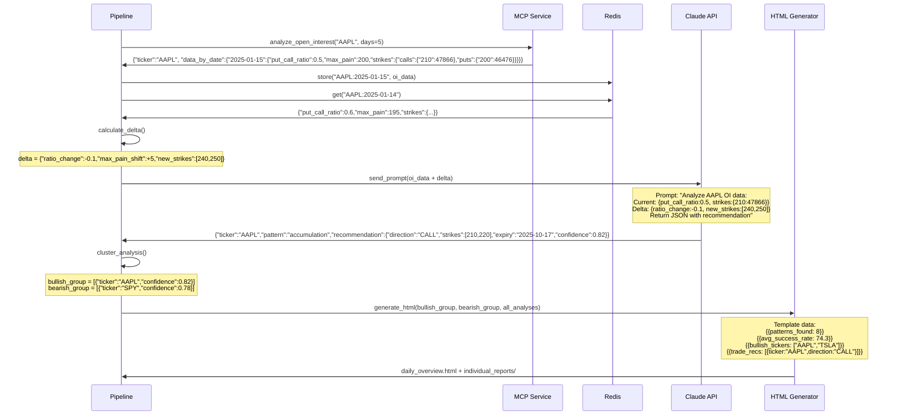
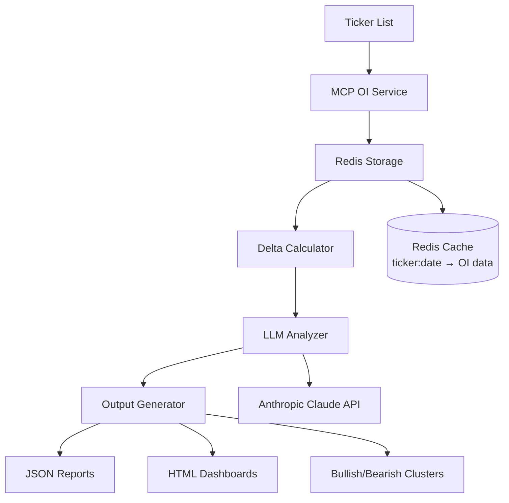
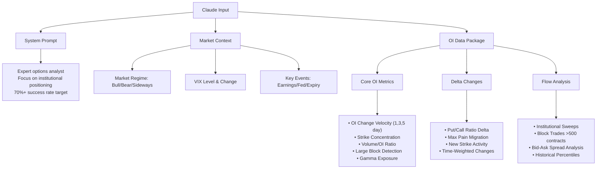
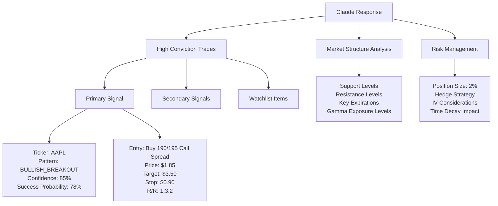
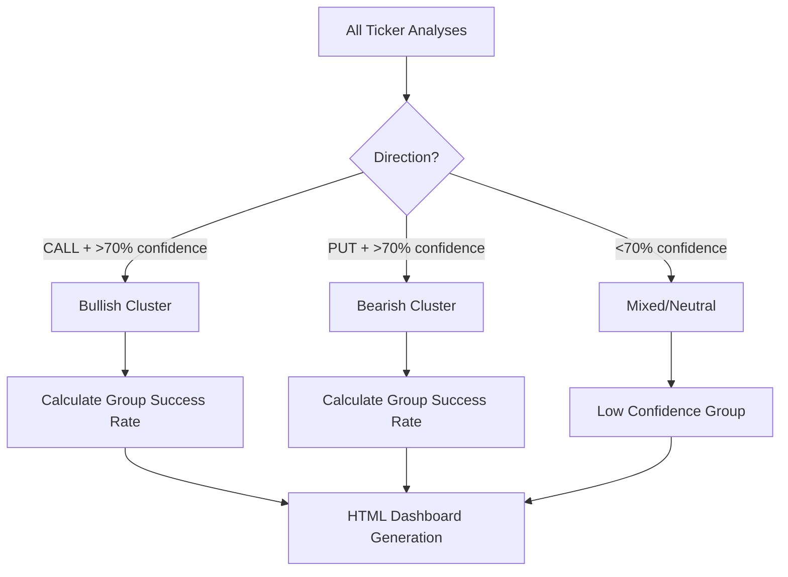
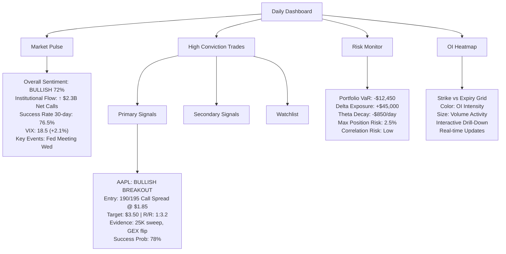
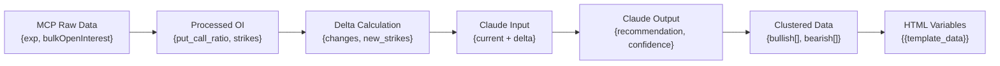
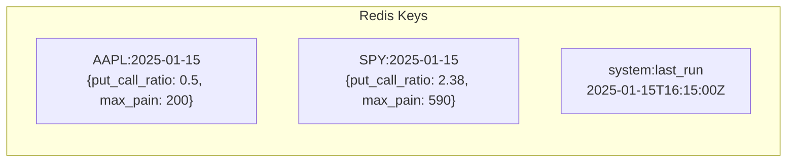
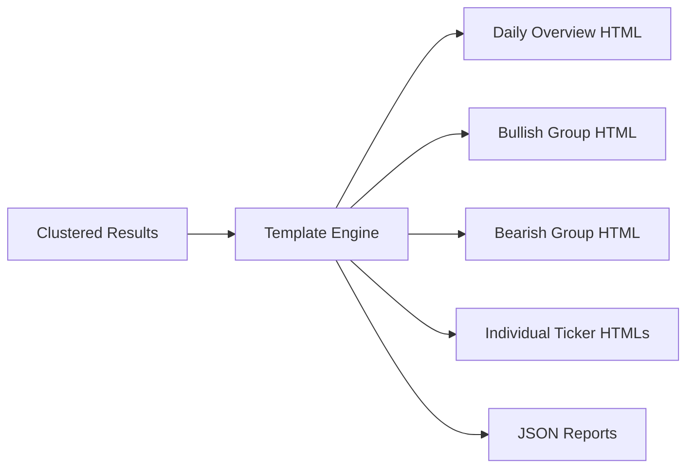

# OI Pattern Tracker - Architecture Design

## 🔄 System Flow Sequence

## 🏗️ Simple System Architecture

## 📋 Enhanced Claude API Input Structure

## 🎯 Enhanced Claude API Output Structure

## 🔄 Clustering Logic

## 🖥️ Critical Dashboard Information Structure

## 📊 Data Transformation Flow

## 🗄️ Redis Data Storage

## 📱 Output Generation Flow

