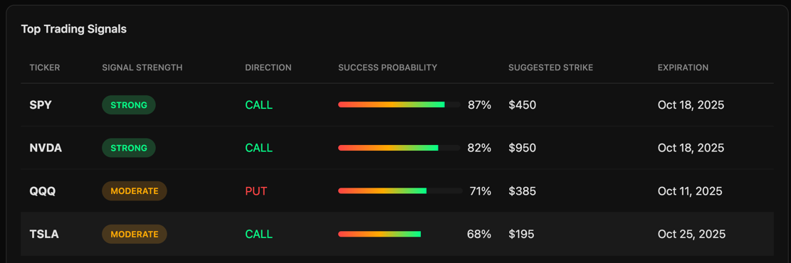
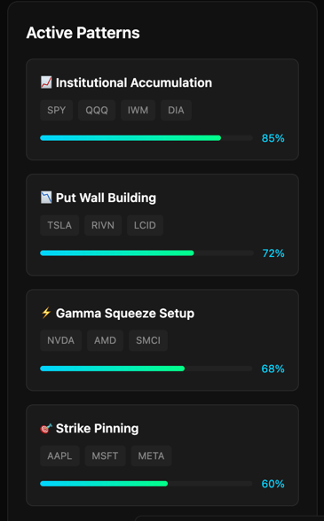

# OI Pattern Tracker - Options Trading Signal System

## 🎯 Project Overview

An intelligent system that analyzes daily open interest (OI) changes across multiple stocks to identify high-probability options trading opportunities. The system tracks OI patterns over 100 days, clusters similar behaviors, and generates specific long call/put recommendations with 70%+ success probability targets.

## 📸 Screen MockUps





## 💡 Core Concept

The system is based on the principle that institutional options positioning (reflected in OI changes) can predict future price movements. By tracking daily OI changes and identifying multi-day patterns, we can:

1. Detect institutional accumulation/distribution
2. Group stocks showing similar OI patterns
3. Generate high-confidence trading signals
4. Recommend specific strikes and expirations (60-70 days out)

## 🔑 Key Features

### 1. **Daily OI Analysis**
- Pulls open interest data for 100+ stocks daily
- Tracks changes in call/put OI
- Calculates put/call ratios and shifts
- Identifies new strike concentrations

### 2. **Pattern Recognition**
- **Accumulation Patterns**: Steady OI increases over 5-10 days
- **Distribution Patterns**: OI unwinding signals
- **Squeeze Setups**: Gamma/short squeeze potential
- **Strike Pinning**: Heavy OI creating price magnets

### 3. **Clustering Algorithm**
Groups stocks showing similar patterns:
- Tech momentum plays
- Sector rotations
- Hedging activity
- Institutional positioning

### 4. **Signal Generation**
Provides specific trade recommendations:
- Exact strike prices
- Optimal expiration dates (60-70 DTE)
- Confidence scores based on historical patterns
- Entry/exit guidelines

## 📊 How It Works

### Daily Process Flow:
```
1. Data Collection → Pull OI data for all tracked tickers
2. Change Calculation → Compare to previous days
3. Pattern Detection → Identify multi-day trends
4. Clustering → Group similar patterns
5. Signal Generation → Create trade recommendations
```

## 🛠 Technical Architecture

### Data Pipeline
- **Collection**: Daily OI snapshots from options chains
- **Storage**: Time-series database for historical analysis
- **Processing**: Python-based pattern recognition
- **Analysis**: ML clustering for pattern grouping

### Key Metrics Tracked
- Total OI changes (daily, 3-day, 7-day, 30-day)
- Put/Call ratio shifts
- Strike distribution changes
- Volume/OI ratios
- Max pain calculations
- Gamma exposure levels


## ⚠️ Disclaimer

This system is for educational and research purposes. Options trading involves significant risk. Past performance does not guarantee future results. Always conduct your own research and consider your risk tolerance before trading.

---
